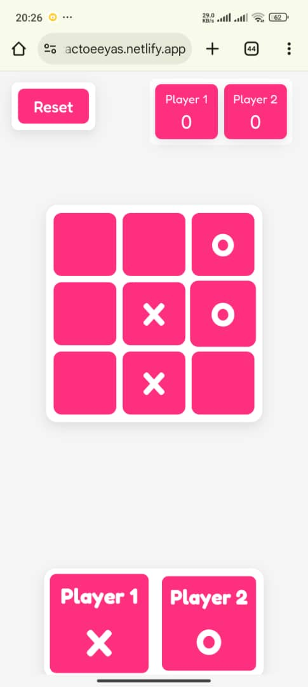

# Tic-Tac-Toe (XO)

## Overview
A simple **Tic-Tac-Toe** (XO) game built with **HTML**, **CSS**, and **Vanilla JavaScript**.  
This project demonstrates DOM manipulation, game state management, and event handling — ideal as a beginner frontend project.  
**Responsive design:** the UI is fully responsive and optimized for all kinds of screens (mobile, tablet, and desktop).

---

## Features
- Two-player local gameplay (X vs O)  
- Win / draw detection and visual highlight for the winning line  
- Reset / New Game button to restart the board  
- Responsive layout for mobile, tablet, and desktop  
- Clean, minimal UI and accessible button targets

---

## Tech Stack
- HTML5  
- CSS3 (Flexbox / Grid)  
- JavaScript (ES6) — DOM manipulation, events

---
